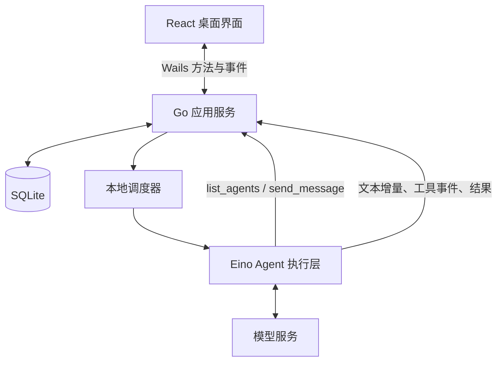
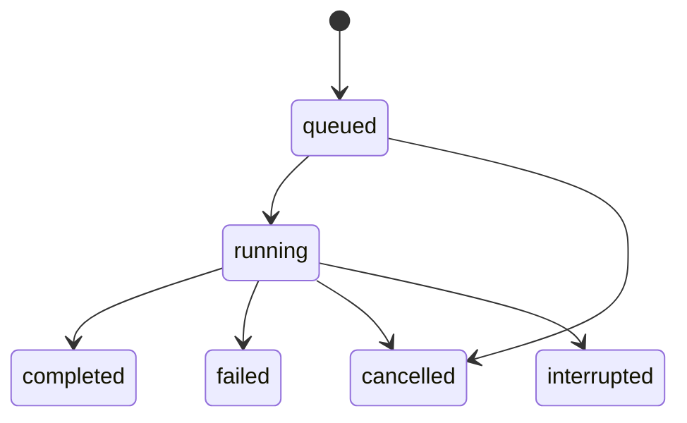

# 同席技术架构

状态：长期维护的技术架构基线；第一期已完成 P0–P4 本地 MVP，首版为 macOS arm64 本机签名安装包；Developer ID 公证和其他平台尚未验收，具体已实现能力和验证结果见本期进度。更新日期：2026-09-27。

各期需求和进度见 [迭代索引](README.md)。后续架构调整更新本文件，并在对应迭代中记录变更原因；完成迭代的需求与验收记录保留。

## 1. 核心决策

采用 **Wails v2 + React/TypeScript + Go + Eino ADK + SQLite**。

同席负责产品、角色身份、会话、消息与调度；Eino 负责运行一次 Agent，包括模型调用、工具调用循环和执行事件。创建角色是保存配置，需要处理消息时才构建或取得对应的执行对象。

当前 Wails 官方文档将 v2 标为稳定版本系列，v3 为 beta，首版采用 v2。P0 已将验证版本锁定到 go.mod、前端依赖文件及锁文件，不直接依赖 main。[Wails 文档](https://wails.io/docs/introduction/)

## 2. 系统结构



应用服务、调度器和 Eino 执行层是同一 Go 进程中的模块。前端通过 Wails 调用业务方法并订阅界面事件；首版不额外启动 HTTP 服务或维护 WebSocket 协议。

SQLite 是业务状态的持久化来源。界面事件和内存唤醒信号用于及时更新，不承担唯一存储职责。

## 3. 模块职责

| 模块 | 负责 | 边界 |
| --- | --- | --- |
| 前端 | 角色列表、会话、群聊方式与主要助手设置、流式内容、停止与错误展示 | 不直接访问模型密钥或数据库 |
| 应用服务 | 角色和会话管理、消息投递、输入校验、UI 事件转换 | 不实现模型推理循环 |
| 调度器 | 认领待执行记录、串行约束、次数限制、取消与启动恢复 | 不让模型决定数据库状态转移 |
| Eino 执行层 | 构建 ChatModelAgent、调用 Runner、消费事件、执行已注册工具 | 不自行决定公开消息应该唤起谁 |
| 存储层 | 数据迁移、事务、消息和运行记录读写 | 不在事务中等待网络或模型调用 |

保持一个简单的 Go 模块，只在测试替换和外部框架边界处引入必要接口。首版不设计通用多运行时插件体系。P0 先提供独立连接验证工作区、单次执行与确定性工具，用于验证模型、流式、取消和存储；该工作区不代表 P1–P4 的角色/群聊能力已实现。

## 4. 领域概念

- **Agent**：长期存在的角色，包含名称、简介、角色指令、模型引用和工具配置。
- **Conversation**：用户与 Agent 的私聊，或多 Agent 的共同会话；多人会话支持主要助手带队和自由讨论，主要助手是带队会话内的职责，不是 Agent 的固定类型。
- **Message**：会话内可见的公开内容，有明确发送者、可选接收者和回复关系。
- **Run**：某个 Agent 对一条触发消息进行的一次执行；同一消息可关联多个不同成员的 Run，聊天中仍只显示一条原始提问。
- **Chain**：由一次用户请求开启的自动协作链，涵盖随后触发的所有 Run，用于统一停止和限制自动交流次数。
- **Model transcript**：供单个 Agent 后续执行使用的模型输入、输出和工具记录，与公开聊天记录分开。

Agent 身份不等于一次执行，也不等于一个常驻进程。会话上下文按 `(agent_id, conversation_id)` 隔离。

## 5. Eino 集成方式

使用 Eino ADK 的 ChatModelAgent + Runner；在执行开始时，把数据库中的角色配置转换成 Agent 的名称、描述、Instruction、Model 和 Tools。

群聊成员默认注册以下两个协作工具，并在系统提示中直接注入当前成员名单和职责。带队模式要求主要助手主动分工，成员可邀请其他非主要助手成员；自由讨论允许成员互相邀请。自动收尾的总结 Run 和后台 selector 不开放这些协作工具：

| 工具 | 参数 | 行为 |
| --- | --- | --- |
| `list_agents` | 无；会话从执行上下文获得 | 返回当前会话中可联系的 Agent ID、名称、简介和启用状态 |
| `send_message` | `target_agent_id`, `content`, 可选 `reply_to_message_id` | 保存有署名的消息，为接收者排队，返回消息和运行标识 |

发送者身份、会话 ID、Chain ID 从服务端当前 Run 上下文注入，不能由模型参数覆盖。接收者必须启用且属于当前会话；自发自收在首版拒绝。回复标识必须属于同一会话。

`send_message` 成功只代表消息和待执行记录已提交，不代表对方已经回复。工具返回排队确认，发送方可完成当前轮次；接收方由调度器异步执行。首版不在工具内部递归等待另一个 Runner。

Eino 的 AgentAsTool 适合「调用子 Agent、得到结果后继续推理」。同席首版的常驻角色通信采用上述异步工具；首个增强场景是「主要助手调用评审 Agent，拿到意见后在原执行流程内继续修改」，不属于一期交付前提。子任务默认独立上下文，可以复用角色配置，不混入该角色已有的私聊或群聊模型历史；将来接入时增加父子执行关联，继承取消、超时与执行预算，避免嵌套子任务等待被父任务占用的唯一调度槽。[Eino ADK 概览](https://www.cloudwego.io/docs/eino/core_modules/eino_adk/agent_preview/)、[Agent 协作](https://www.cloudwego.io/docs/eino/core_modules/eino_adk/agent_collaboration/)

消费 Runner 事件时，应处理普通消息、流式消息、工具调用和错误，并按所锁定版本的规则关闭流。只转发模型公开返回的文本和执行状态，不要求展示模型内部推理。

模型配置与角色指令在 Run 开始时形成快照，执行中修改角色只影响后续 Run。快照保留模型参数和密钥引用，不写入密钥明文。

## 6. 消息投递与调度

### 6.1 两种群聊模式（0.1.2）

两种模式共用全局串行队列和成员消息工具。带队模式把分工及最终汇总职责赋予主要助手；自由讨论的 selector 仅决定下一位发言者或暂停，不发布成员消息、不分配子任务，也不承担汇总职责。自由讨论仍是集中调度，不是多个 Agent 同时监听和抢话。相同成员和问题可能产生相似发言，模式区别由组织职责与收尾规则体现。产品场景与对照见 [两种模式的需求说明](002-free-discussion-20260927/requirements.md#模式定位与区别)。

- 两种群聊统一直接发送。会话设置提供主要助手带队和自由讨论；自由讨论不配置主要助手。
- discussion 请求事务保存用户消息、Chain 和 selector Run。选择器复用第一位启用成员的模型连接，但使用独立提示词和公开上下文，不消费成员游标、不读取成员私有历史。
- choose_speaker 只安排一位候选成员，pause_discussion 暂停；候选过滤刚发言者、停用成员及对同一输入已沉默的成员。成员可用 skip_reply 沉默，或用 send_message 邀请其他成员。Eino 直接返回工具结束本次执行。
- 自由讨论最多 6 次发言机会（含跳过）和 6 次选人，沿用超时与模型迭代上限。无新内容或到限后等待用户，不强制总结。
- 用户新消息在同一事务停止本会话旧自由讨论，再保存新问题与选择任务；服务取消旧上下文。失败事务与幂等重放不误停当前话题。终止状态保护迟到正文和工具。
- 主要助手按职责主动调用 send_message 分配任务。工具排队后结束当前 Run，其他成员串行执行；伙伴只需公开回复，无需显式把任务发回主要助手。
- 最后一个成员成功完成、链内无在途任务时，在保存回复的同一事务中新增主要助手总结 Run；触发消息保持用户原问题，父任务关联最后一位成员，读取已有公开意见与主要助手自身历史。
- send_message 最多占用前 5 次执行，第 6 次保留给总结；成员重试也保留这一额度。总结 Run 可以显式重试，但不能继续投递形成循环。仅寒暄或明确要求主要助手独自回答时可直接结束。
- 停止、失败、崩溃和停用沿用协作链终止规则；停用主要助手即使它当前不在执行，也会停止它主持的在途协作。停止后的迟到回复不能追加总结。
- 原来的 round、mention、summary、publish 后端分支仅兼容旧记录和已有调用，当前界面不再提供这些入口。会话无在途任务时才可编辑设置。

### 6.2 一次投递

1. 用户在群聊直接发送任务，或者当前协作中的 Agent 调用 `send_message`。
2. 应用服务验证发送者、接收者、会话、回复关系和 Chain 状态。
3. 在短事务中写入一条公开消息和 queued Run。带队请求交给主要助手，自由讨论先交给后台 selector；成员 Run 预留发言额度，单次工具投递对应一个接收者。
4. 事务提交后发出内存唤醒信号，通知界面刷新。
5. 调度器认领 Run；加载角色快照和该 Agent 在本会话中的上下文。
6. Eino 执行，界面接收文本增量和状态事件。
7. 完成时保存模型记录；最终公开回复与 Run 完成状态一并提交。
8. 带队成员完成后自动汇总；自由讨论在没有邀请待办时安排后台选人，判断是否继续。旧轮流讨论仅推进预先安排的下一位。

旧发布分支仅兼容历史。成员通过消息工具传递准确 Agent ID，正文中的同名字符串不能成为唯一的路由依据。

### 6.3 首版并发策略

- 调度器先采用一个执行槽，全局按入队顺序执行。这是 MVP 的复杂度取舍，不是 Eino 的限制。
- 新消息在当前执行期间正常保存和排队，不修改正在运行的上下文。
- 后续确实需要并行时，增加有界执行槽，并保证同一 Agent 的执行串行；不改变消息存储和工具语义。
- 调度状态由 Go 服务拥有，关闭或切换聊天界面不改变调度归属。

### 6.4 有界协作和幂等

- 默认每个 Chain 最多预留 6 个 Agent Run，计入初次执行、后续投递及重试；达到上限后保留已有记录并停止新增执行，界面展示原因。
- 额度检查、Chain 状态检查和 queued Run 写入必须在同一事务中完成，不能靠提示词实现限制。轮流讨论开始前检查参与人数是否超出预算，超出时明确提示缩减人数，不只邀请前几位。
- 轮流讨论同一 Chain 内每个位置只能有一个初始 Run；重送用户操作返回整组原有安排。讨论失败后重新发起操作创建新 Chain，带队流程的手动重试沿用下述规则。
- Eino 的 `MaxIterations` 限制单个 Run 内部的模型/工具循环，不能代替 Chain 的执行次数限制。另设单次运行超时。[ChatModelAgent 配置](https://www.cloudwego.io/docs/eino/core_modules/eino_adk/agent_implementation/chat_model/)
- 用户投递携带 `client_request_id`；工具投递使用 `(run_id, tool_call_id)` 作为幂等键。同一请求重送时返回原结果，不再创建消息和 Run。
- 带队流程手动重试生成新 Run，关联原 Run，并使用同一 Chain 的剩余额度；用户明确发起新的交流才创建新 Chain。
- 对未知结果不承诺「模型只调用一次」。应用可保证本地入队不重复，网络请求和外部工具的恰好一次执行不属于首版能力。

## 7. 上下文与聊天历史

公开聊天记录用于人和 Agent 了解共同讨论；完整模型 transcript 用于保留该 Agent 的工具调用和工具结果。二者不能互相替代。

每个会话成员维护自己的消息读取游标。Run 开始时固定本次读取的消息上界，把尚未读到的公开消息连同发送者信息纳入输入；输入及游标在同一事务中提交，避免重复注入。正在执行期间产生的新消息由后续 Run 读取。

其他 Agent 的公开发言作为带署名的外部输入进入上下文，不能伪装成当前 Agent 的 assistant 输出或系统指令。其他会话、其他 Agent 的私有工具轨迹不进入本次上下文。

保存模型历史时保留工具调用 ID 和对应结果。首版采用有限历史窗口：保留角色指令、当前请求和最近完整轮次；按所选模型预算裁剪，不能只按条数无限堆积，也不能把工具调用和结果拆开。长历史总结后续加入。

Eino 多轮示例由调用方维护历史。同席自行负责业务历史持久化；Checkpoint 用于执行中断恢复，MVP 暂不把它作为普通聊天记录的替代品。[Eino 多轮示例](https://www.cloudwego.io/docs/eino/quick_start/chapter_02_chatmodelagent_runner_agentevent/)

## 8. 数据存储

目标是保持少量普通关系表，不建设完整事件溯源系统。以下为逻辑模型，具体迁移在实施时落地。

| 表 | 核心数据与约束 |
| --- | --- |
| `agents` | ID、名称、简介、角色指令、模型配置、密钥引用、工具配置、启用状态、配置版本 |
| `conversations` | ID、标题、私聊/多人类型、协作方式、可选主要助手 ID、创建和更新时间 |
| `conversation_members` | conversation_id、agent_id、消息读取游标；二者联合唯一，同时标识该成员的独立模型会话 |
| `messages` | ID、会话内顺序、发送者类型及 ID、接收者、正文、reply_to、chain_id、幂等键、时间 |
| `chains` | ID、会话、根消息、模式/操作/主要助手/有序参与者快照、active/stopped 状态、最大次数、已预留次数、停止原因 |
| `runs` | ID、Agent、会话、触发消息、Chain、可选发言顺序与前置 Run、父 Run、重试来源、状态、配置快照、错误、起止时间 |
| `model_messages` | ID、Agent、会话、Run、顺序、消息角色及模型消息 JSON，保存完整工具调用/结果 |

一个模型消息序列只属于一个 `(agent_id, conversation_id)`。UI 默认读取公开 messages，模型调用读取该成员的 transcript 加新公开消息。

SQLite 开启 WAL，写事务保持短小，首版集中通过存储层串行写入。内存队列只作提示，queued Run 是可恢复的待办来源。应用启动扫描待办，因此即便提交后尚未发送唤醒信号就退出，也不会丢失已提交的任务。

数据存放在操作系统用户应用数据目录的 `tongxi` 子目录；`make dev` 默认使用仓库 `.local/dev`，测试使用独立临时目录，可通过 `TONGXI_DATA_DIR` 指定其他目录。模型密钥由后端通过操作系统凭据存储管理，数据库仅存引用，设置界面的密码输入仅用于提交新密钥，提交后清空，不写入前端持久化、不回传已有密钥，也不进入日志。

P1 已落地数据库版本 2：保留 P0 两张验证表，新增角色、会话、有序成员、公开消息和基础运行记录。消息保存发送者 ID 及发言时的名称快照，改名或停用不改写历史署名。P2 版本 3 在 runs 中保存完整轮次 transcript、配置快照、状态/输出/revision，增加 deliveries 投递表，应用层提供单执行槽调度。私聊消息和初始 Run 原子入队；完成回复和状态原子提交。按 `(agent_id, conversation_id)` 读取最近最多 12 个完整成功轮次、最多 48,000 个序列化字符，保留工具调用/结果配对，失败/取消不回放。queued 在启动后扫描，running 标为 interrupted。

P3 版本 4 增加 chains、tool_deliveries、member_cursors：集中 Schedule 事务处理私聊、主要助手、普通发布、点名、轮流讨论和总结；冻结模式、主要助手与有序参与者，预留最多 6 次执行。轮流发言与工具接收任务都有显式前序成功依赖，前序失败/中断会取消本次后续任务。send_message 从持久化 Run 绑定身份与会话，只创建公开投递及 queued 任务，不等待接收者，按 (run_id, tool_call_id) 幂等；只有 lead 安排开放协作工具。

群聊在认领事务中保存 input_messages、read_from/read_upper 与成员游标。新增公开内容最多取最近 50 条、24,000 字符，同时始终保留当前触发消息；其他成员内容以具名外部 UserMessage 注入，私有工具记录不共享。执行失败恢复已认领任务的游标；未认领任务取消不改动旧游标，重启只恢复本次中断的活动 Chain。成员游标单独存表，修改成员顺序不会删除阅读进度。群聊普通发布仅保存消息；P1 未执行的私聊公开消息不自动转成模型 transcript。配置快照不含密钥或引用，实际密钥在执行开始从系统凭据存储读取并仅留在该次执行的内存中。

角色分别保存 Base URL、模型与凭据引用。新角色在服务地址相同时可复用默认连接的凭据引用；随后修改默认配置不会改写角色配置。替换密钥后，仅清理不再被默认配置或任何角色引用的旧条目。角色编辑使用配置版本检查，避免旧表单覆盖较新的修改。

## 9. 执行状态、停止与重启



- `queued`：已经持久化，等待调度。
- `running`：已认领并开始执行。
- `completed`：最终结果已保存。
- `failed`：模型、工具或应用执行失败，保留可理解的原因。
- `cancelled`：明确停止并完成取消处理。
- `interrupted`：应用退出或执行所有权丢失，结果尚不确定。

首版的「停止」作用于当前 Chain：先持久化 stopped，取消其 queued Run，再向正在运行的上下文发送取消请求。工具投递和 Run 认领都必须重新检查 Chain 状态，避免停止后继续派生任务。晚到事件不能把 cancelled Run 改成 completed；已经发布的消息不回滚。

停止不代表撤销已发生的工具效果。首版工具只有本地消息操作，后续增加实际工作工具时再定义各工具的取消与重试语义。

退出应用时停止认领新任务并尝试取消正在运行的任务。再次启动后把残留 running 标记为 interrupted，不自动重放；仍有效的 queued 记录继续等待处理，已停止 Chain 的待办不执行。中断/失败重试由用户明确触发。

P4 数据库版本 5 增加 retry_of 唯一索引及 retry_requests。带队/私聊失败或中断可手动生成一次直接重试，复用原触发消息与 Chain、预留一次额度；重试再失败时操作新失败记录。旧失败和 cancelled 后续任务均不复活。stopped Chain 不可重新激活；讨论重新安排创建新 Chain。会话保存递增配置版本，与 Chain 创建时版本不同时禁止重试，避免用旧协作安排操作已改变的成员/模式。

停止及停用事务保存所有受影响 queued/running 的取消状态和可见部分内容；应用服务在提交后取消上下文，磁盘失败时仍请求模型取消并返回错误。停用角色会结束涉及该角色待办的在途 Chain，其他独立协作保留。正常退出先保存 interrupted 与部分内容，再取消执行；启动恢复只处理当时残留 running，不把历史失败记录当作依据再次取消显式重试。

流式文字是暂时展示内容，不能在失败时伪装成完成回复。失败或取消后显示明确标记；需要保留的部分内容以未完成状态处理。

## 10. 界面和工程组织

首版界面：左侧 Agent 与会话列表，中间聊天内容，右侧或弹窗编辑角色配置；会话顶部显示群聊方式，带队模式另显示主要助手。群聊统一直接发送，带队自动邀请与总结，自由讨论按话题接话并自然暂停。运行状态、排队和停止必须直接可见。

拟采用的工程结构：

```text
frontend/                  React 页面和 Wails 调用
internal/app/              业务方法、消息路由、界面事件
internal/agent/            Eino 构建和执行事件转换
internal/scheduler/        认领、停止、次数限制与启动恢复
internal/store/            SQLite 读写及迁移
plan/                      产品与实施规划
```

先实现真实纵向链路再拆细目录；不为空的潜在能力提前建包。默认停用 Agent 而非删除其历史，历史发言仍能辨认作者。

## 11. 延后决策

以下能力出现具体使用需求后再设计，不作为 MVP 的隐含依赖：多模型供应商矩阵、AgentAsTool、TurnLoop 抢占、Checkpoint 自动恢复、MCP、Skills、跨会话记忆、现成 Agent 适配和跨机器通信。

参考方案的采用边界见 [参考项目](references.md)，落地顺序与实施状态见 [迭代索引](README.md)。

数据库版本 6 增加 runs.kind（reply/selector）和 silent 标记；复用既有队列、前序依赖、停止与恢复，不增加独立后台线程。
