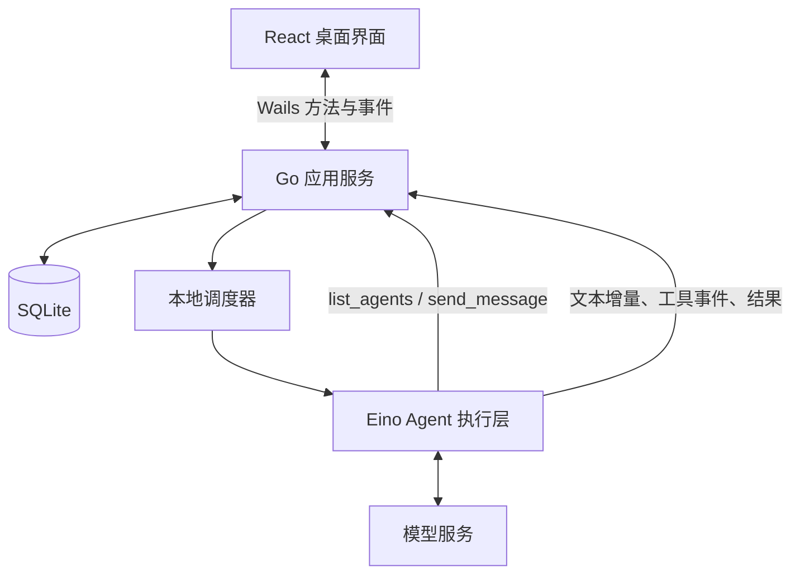
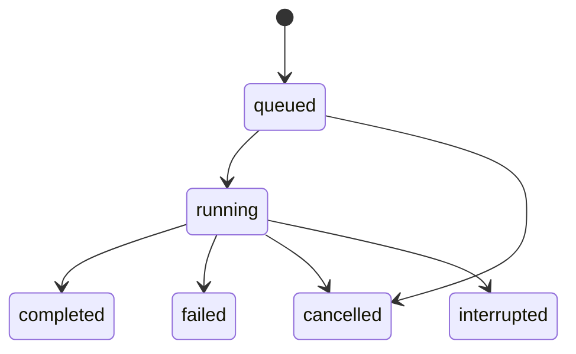

# 同席技术架构

状态：长期维护的技术架构基线；第一期已完成 P0–P4 本地 MVP，首版为 macOS arm64 本机签名安装包；Developer ID 公证和其他平台尚未验收，具体已实现能力和验证结果见本期进度。更新日期：2026-09-27。

各期需求和进度见 [迭代索引](README.md)。后续架构调整更新本文件，并在对应迭代中记录变更原因；完成迭代的需求与验收记录保留。

## 1. 核心决策

采用 **Wails v2 + React/TypeScript + Go + Eino ADK + SQLite**。

同席负责产品、角色身份、会话、消息与调度；Eino 负责运行一次 Agent，包括模型调用、工具调用循环和执行事件。创建角色是保存配置，需要处理消息时才构建或取得对应的执行对象。

当前 Wails 官方文档将 v2 标为稳定版本系列，v3 为 beta，首版采用 v2。P0 已将验证版本锁定到 go.mod、前端依赖文件及锁文件，不直接依赖 main。[Wails 文档](https://wails.io/docs/introduction/)

## 2. 系统结构



应用服务、调度器和 Eino 执行层是同一 Go 进程中的模块。前端通过 Wails 调用业务方法并订阅界面事件；首版不额外启动 HTTP 服务或维护 WebSocket 协议。

SQLite 是业务状态的持久化来源。界面事件和内存唤醒信号用于及时更新，不承担唯一存储职责。

## 3. 模块职责

| 模块 | 负责 | 边界 |
| --- | --- | --- |
| 前端 | 角色列表、会话、群聊方式与主要助手设置、流式内容、停止与错误展示 | 不直接访问模型密钥或数据库 |
| 应用服务 | 角色和会话管理、消息投递、输入校验、UI 事件转换 | 不实现模型推理循环 |
| 调度器 | 认领待执行记录、串行约束、时间预算、取消与启动恢复 | 不让模型决定数据库状态转移 |
| Eino 执行层 | 构建 ChatModelAgent、调用 Runner、消费事件、执行已注册工具 | 不自行决定公开消息应该唤起谁 |
| 存储层 | 数据迁移、事务、消息和运行记录读写 | 不在事务中等待网络或模型调用 |

保持一个简单的 Go 模块，只在测试替换和外部框架边界处引入必要接口。首版不设计通用多运行时插件体系。P0 先提供独立连接验证工作区、单次执行与确定性工具，用于验证模型、流式、取消和存储；该工作区不代表 P1–P4 的角色/群聊能力已实现。

## 4. 领域概念

- **Agent**：长期存在的角色，包含名称、简介、角色指令、模型引用和工具配置。
- **Conversation**：用户与 Agent 的私聊，或多 Agent 的共同会话；多人会话支持主要助手带队和自由讨论，主要助手是带队会话内的职责，不是 Agent 的固定类型。
- **Message**：会话内可见的公开内容，有明确发送者、可选接收者和回复关系。
- **Run**：某个 Agent 对一条触发消息进行的一次执行；同一消息可关联多个不同成员的 Run，聊天中仍只显示一条原始提问。
- **Chain**：由一次用户请求开启的自动协作链，涵盖随后触发的所有 Run，用于统一停止和限制自动交流耗时。
- **Model transcript**：供单个 Agent 后续执行使用的模型输入、输出和工具记录，与公开聊天记录分开。

Agent 身份不等于一次执行，也不等于一个常驻进程。会话上下文按 `(agent_id, conversation_id)` 隔离。

## 5. Eino 集成方式

使用 Eino ADK 的 ChatModelAgent + Runner；在执行开始时，把数据库中的角色配置转换成 Agent 的名称、描述、Instruction、Model 和 Tools。

自由讨论和旧版带队任务使用以下消息工具，系统提示直接注入当前成员名单和职责；后台 selector 不开放这些工具。0.1.3 新带队任务由主要助手通过 advance_work 提交验收和单次委托，受邀成员直接交付内容或把邀请建议交回主要助手：

| 工具 | 参数 | 行为 |
| --- | --- | --- |
| `list_agents` | 无；会话从执行上下文获得 | 返回当前会话中可联系的 Agent ID、名称、简介和启用状态 |
| `send_message` | `target_agent_id`, `content`, 可选 `reply_to_message_id` | 保存有署名的消息，为接收者排队，返回消息和运行标识 |
| `advance_work`（新带队主要助手） | `action`, `checks`, `result`, `reason`, `next_agent_id`, `task` | 记录验收和完整成果；委托一位、交付或暂停。每个主要助手 Run 仅一次有效决定 |

发送者身份、会话 ID、Chain ID 从服务端当前 Run 上下文注入，不能由模型参数覆盖。接收者必须启用且属于当前会话；自发自收在首版拒绝。回复标识必须属于同一会话。

`send_message` 成功只代表消息和待执行记录已提交，不代表对方已经回复。工具返回排队确认，发送方可完成当前轮次；接收方由调度器异步执行。首版不在工具内部递归等待另一个 Runner。

Eino 的 AgentAsTool 适合「调用子 Agent、得到结果后继续推理」。同席首版的常驻角色通信采用上述异步工具；首个增强场景是「主要助手调用评审 Agent，拿到意见后在原执行流程内继续修改」，不属于一期交付前提。子任务默认独立上下文，可以复用角色配置，不混入该角色已有的私聊或群聊模型历史；将来接入时增加父子执行关联，继承取消、超时与执行预算，避免嵌套子任务等待被父任务占用的唯一调度槽。[Eino ADK 概览](https://www.cloudwego.io/docs/eino/core_modules/eino_adk/agent_preview/)、[Agent 协作](https://www.cloudwego.io/docs/eino/core_modules/eino_adk/agent_collaboration/)

消费 Runner 事件时，应处理普通消息、流式消息、工具调用和错误，并按所锁定版本的规则关闭流。只转发模型公开返回的文本和执行状态，不要求展示模型内部推理。

模型配置与角色指令在 Run 开始时形成快照，执行中修改角色只影响后续 Run。快照保留所选模型配置与模型参数，不写入密钥或凭据引用。

## 6. 消息投递与调度

### 6.1 两种群聊模式（当前实现）

两种模式共用全局串行队列和公开消息。带队模式把分工、持续验收和完整成果交付职责赋予主要助手；自由讨论的 selector 仅决定下一位发言者或暂停，不发布成员消息、不分配子任务，也不承担汇总职责。自由讨论仍是集中调度，没有实现多个 Agent 同时监听和抢话。产品场景与验收见 [带队迭代](003-lead-acceptance-20260928/requirements.md)和[自由讨论需求](002-free-discussion-20260927/requirements.md)。

- 两种群聊统一直接发送。会话设置提供主要助手带队和自由讨论；自由讨论不配置主要助手。
- discussion 请求事务保存用户消息、Chain 和 selector Run。选择器复用第一位启用成员的模型连接，但使用独立提示词和公开上下文，不消费成员游标、不读取成员私有历史。
- choose_speaker 只安排一位候选成员，pause_discussion 暂停；候选过滤刚发言者、停用成员及对同一输入已沉默的成员。成员可用 skip_reply 沉默，或用 send_message 邀请其他成员。Eino 直接返回工具结束本次执行。
- 自由讨论不限制发言机会（含跳过）或选人次数。选择器在无新内容、重复观点或等待必要信息时暂停，不强制总结。
- 用户新消息在同一事务停止本会话旧自由讨论，再保存新问题与选择任务；服务取消旧上下文。失败事务与幂等重放不误停当前话题。终止状态保护迟到正文和工具。
- 新带队 Chain 的 lead_policy=1，主要助手通过 advance_work 提交 checks、完整 result、reason 和 delegate/complete/pause 决定。第一次确定条件，之后校验条件原文和顺序不变；单个 Run 仅接受一个决定。角色身份、启用状态和接收者范围由后端校验。
- delegate 原子保存 lead_steps、chains.work、公开邀请和一位成员的 queued Run；Eino 直接返回结束本轮。成员完成后，在保存回复的同一事务中增加主要助手检查 Run，触发消息保持原始用户请求，父任务关联刚完成的成员。
- 主要助手和成员均读取最新 work 快照。检查后可再次委托、交付或暂停。complete 要求所有条件 met、依据非空、完整成果非空，并在主要助手 Run 成功完成后才把 Chain 标为 completed；pause 标为 incomplete。正文没有有效决定不会被当成完成。
- 带队不限制执行次数；主要助手按验收标准交付，连续两次完整成果和验收状态不变时转为 pause。两种自动协作统一使用从首个 Run 开始、默认 20 分钟的截止时间与累计 Token 预算，到期中止执行并暂停后续工作，保留草稿。暂停不能被当成验收通过。
- 停止、失败、崩溃和停用沿用协作链终止规则；停用主要助手即使它当前不在执行，也会停止它主持的在途协作。停止后的迟到回复不能继续派生检查任务。
- 原来的 round、mention、summary、publish 后端分支仅兼容旧记录和已有调用，当前界面不再提供这些入口。会话无在途任务时才可编辑设置。

#### 按验收推进带队（0.1.3，2026-09-28）

0.1.1–0.1.2 带队在受邀成员完成后直接进入最终总结，不能继续安排修改。0.1.3 将新任务改为主要助手围绕可交付成果持续组织和验收；自由讨论暂不调整。

- **先明确成果与验收条件**：从用户目标和约束提取简短、可检查的条件，随开场发言展示。用户已给出的标准优先；缺失时由主要助手提出合理标准和假设，只有缺少影响结果的关键信息才追问，不新增必填表单或逐轮审批。
- **每次优先邀请一位**：根据当前最重要的缺口和成员职责选择下一位，并说明要完成或检查什么。成员提交结果后先回到主要助手，由它决定继续找原成员修改、邀请另一位评审、自己完善成果或交付；不预先让全体成员各说一遍。
- **持续修改同一份成果**：每次委托携带当前成果、相关意见和仍未满足的条件。评审围绕具体缺口给出依据与修改建议，下一轮更新成果，避免只堆积讨论或反复从头写方案。
- **验收驱动追加讨论**：未满足条件且仍能推进时继续；达到条件即可结束，不规定必须聊满几轮。较复杂成果可交给适合的成员独立评审；可用工具验证的条件应记录实际检查结果，模型评价本身不能当作事实已核实的证据。
- **明确终止原因**：保留时间预算，避免无限讨论。达到预算、连续没有实质进展或缺少关键信息时，交付当前可用部分并列明缺口，标记为未完成或等待用户；不能因为到期就宣称验收通过。
- **最终交付可使用的结果**：主要助手提供满足用户目标的完整成果，保留必要假设、未决问题和依据，不仅复述谁说了什么；详细程度服从任务需要，不能把篇幅长等同于质量高。用户仍只需发送、补充或停止。

例如，30 分钟读书会方案可约定总时长正确、每个环节有执行方式、人员与物料清楚、内向参与者可以跳过；人数和场地未知时标明假设。策划先给方案，主要助手检查缺口，再按需要邀请评审或让策划修订，满足条件后交付。示例不固定角色和发言顺序。

这一方向与自由讨论的区别在于主要助手持续对验收和交付负责；自由讨论仍围绕观点展开，没有固定成员承担完整成果的交付职责，也不因暂停而宣称达成共识。

### 6.2 一次投递

1. 用户在群聊直接发送任务，或主要助手通过 `advance_work` 委托下一位，或自由讨论成员调用 `send_message`。
2. 应用服务验证发送者、接收者、会话、回复关系和 Chain 状态。
3. 在短事务中写入一条公开消息和 queued Run。带队请求交给主要助手，自由讨论先交给后台 selector；成员 Run 记录已安排次数，单次工具投递对应一个接收者。
4. 事务提交后发出内存唤醒信号，通知界面刷新。
5. 调度器认领 Run；加载角色快照和该 Agent 在本会话中的上下文。
6. Eino 执行，界面接收文本增量和状态事件。
7. 完成时保存模型记录；最终公开回复与 Run 完成状态一并提交。
8. 新带队成员完成后返回主要助手检查并决定下一步；自由讨论在没有邀请待办时安排后台选人。旧带队仍自动汇总，旧轮流讨论仅推进预先安排的下一位。

旧发布分支仅兼容历史。成员通过消息工具传递准确 Agent ID，正文中的同名字符串不能成为唯一的路由依据。

### 6.3 首版并发策略

- 调度器先采用一个执行槽，全局按入队顺序执行。这是 MVP 的复杂度取舍，不是 Eino 的限制。
- 新消息在当前执行期间正常保存和排队，不修改正在运行的上下文。
- 后续确实需要并行时，增加有界执行槽，并保证同一 Agent 的执行串行；不改变消息存储和工具语义。
- 调度状态由 Go 服务拥有，关闭或切换聊天界面不改变调度归属。

### 6.4 有界协作和幂等

- 带队和自由讨论不设置 Run 次数上限。截止时间由同一 Chain 第一个已启动 Run 的 started_at 加本次保存的时长预算得出（默认 20 分钟，0 不限），持久记录使重试、重启无法重置；初次排队不计时。
- 委托、选人、重试和收尾在事务中检查时间、Token 总量与 Chain 状态。调度器在调用模型前检查截止时间，并把剩余时间用于当前执行的 context deadline；到期将 Chain 置为 incomplete，取消后续任务，不发布未完成回复或正式成果。
- 轮流讨论同一 Chain 内每个位置只能有一个初始 Run；重送用户操作返回整组原有安排。讨论失败后重新发起操作创建新 Chain，带队流程的手动重试沿用下述规则。
- Eino 的 `MaxIterations` 限制单个 Run 内部的模型/工具循环，不能代替 Chain 的总时间预算。另设单次运行超时。[ChatModelAgent 配置](https://www.cloudwego.io/docs/eino/core_modules/eino_adk/agent_implementation/chat_model/)
- 用户投递携带 `client_request_id`；工具投递使用 `(run_id, tool_call_id)` 作为幂等键。同一请求重送时返回原结果，不再创建消息和 Run。
- 带队流程手动重试生成新 Run，关联原 Run，并使用同一 Chain 的截止时间；用户明确发起新的交流才创建新 Chain。
- 对未知结果不承诺「模型只调用一次」。应用可保证本地入队不重复，网络请求和外部工具的恰好一次执行不属于首版能力。

## 7. 上下文与聊天历史

公开聊天记录用于人和 Agent 了解共同讨论；完整模型 transcript 用于保留该 Agent 的工具调用和工具结果。二者不能互相替代。

每个会话成员维护自己的消息处理位置。Run 开始时固定本次读取上界，把全部未处理的公开消息连同发送者信息纳入待处理输入。执行成功后才将位置与压缩上下文、执行状态及正式回复一起提交；失败、取消和保存失败不推进。正在执行期间产生的新消息由后续 Run 读取。

其他 Agent 的公开发言作为带署名的外部输入进入上下文，不能伪装成当前 Agent 的 assistant 输出或系统指令。其他会话、其他 Agent 的私有工具轨迹不进入本次上下文。

0.1.17 取消固定 12 轮、50 条和字符截断。SQLite 的 context_states 按 `(conversation_id, agent_id, kind)` 保存已压缩上下文（摘要与较近原文）、覆盖的 Run rowid 和公开消息上界；新执行只追加未覆盖的已完成记录。selector 与 reply 独立保存，不读取彼此私有轨迹。系统指令、当前任务状态和技能目录每次重新加载，不作为旧指令保存。

每个模型配置 context_tokens，默认保守值 32768，可在高级设置中按实际服务容量修改。为输出预留 `min(8192, capacity/4)`，安全余量为容量的 10%；其余为输入预算。全量输入包含系统指令、当前任务/成果、历史、工具定义及结果。估算采用 ASCII 四字符/Token、非 ASCII 两 Token/字符的保守基线，再乘服务商 prompt_tokens 校准系数与 10% 估算余量；容量不是由用量推断出来的。

每次模型请求前：Eino reduction 在输入预算 70% 时缩减旧工具结果，summarization 在 90% 时摘要旧讨论。大工具结果通过 reduction.Backend 转存 SQLite context_tool_results；给模型分页回读工具。摘要按预算分批，保留当前系统/任务、最新用户请求和最新工具轮次；工具调用与结果不拆散。摘要正文不包含思考过程、旧技能正文，也不将历史文件内容当作最新内容。压缩后的状态在成功 Run 结束时原子提交，原始 transcript 和 messages 不删除。

search_chat_history 按字面关键词查询当前会话公开消息，支持中文和向前翻页；read_chat_history 按消息 ID/序号读取原文、前后文及长消息续页。read_tool_result 只能读取当前角色在本会话的转存工具结果，不查询其他成员私有数据。所有返回内容视为历史资料而非新指令。工作目录不创建 history 目录。摘要有损，当前目标、验收、成果与待补资料始终由原有任务/版本表单独提供。

Eino 多轮示例由调用方维护历史。同席自行负责业务历史持久化；Checkpoint 用于执行中断恢复，MVP 暂不把它作为普通聊天记录的替代品。[Eino 多轮示例](https://www.cloudwego.io/docs/eino/quick_start/chapter_02_chatmodelagent_runner_agentevent/)

## 8. 数据存储

目标是保持少量普通关系表，不建设完整事件溯源系统。以下为逻辑模型，具体迁移在实施时落地。

| 表 | 核心数据与约束 |
| --- | --- |
| `model_configs` | ID、显示名称、服务商、地址、模型 ID、密钥引用、配置版本 |
| `agents` | ID、名称、简介、角色指令、model_id、工具配置、启用状态、配置版本 |
| `conversations` | ID、标题、私聊/多人类型、协作方式、可选主要助手 ID、创建和更新时间 |
| `conversation_members` | conversation_id、agent_id、消息读取游标；二者联合唯一，同时标识该成员的独立模型会话 |
| `messages` | ID、会话内顺序、发送者类型及 ID、接收者、正文、reply_to、chain_id、幂等键、时间 |
| `chains` | ID、会话、根消息、模式/操作/主要助手/有序参与者快照、active/stopped 状态、已安排次数、停止原因 |
| `runs` | ID、Agent、会话、触发消息、Chain、可选发言顺序与前置 Run、父 Run、重试来源、状态、配置快照、错误、起止时间 |
| `model_messages` | ID、Agent、会话、Run、顺序、消息角色及模型消息 JSON，保存完整工具调用/结果 |

一个模型消息序列只属于一个 `(agent_id, conversation_id)`。UI 默认读取公开 messages，模型调用读取该成员的 transcript 加新公开消息。

SQLite 开启 WAL，写事务保持短小，首版集中通过存储层串行写入。内存队列只作提示，queued Run 是可恢复的待办来源。应用启动扫描待办，因此即便提交后尚未发送唤醒信号就退出，也不会丢失已提交的任务。

数据存放在操作系统用户应用数据目录的 `tongxi` 子目录；`make dev` 默认使用仓库 `.local/dev`，测试使用独立临时目录，可通过 `TONGXI_DATA_DIR` 指定其他目录。模型密钥由后端通过操作系统凭据存储管理，数据库仅存引用，设置界面的密码输入仅用于提交新密钥，成功保存后清空，不写入前端持久化、不回传已有密钥，也不进入日志。

P1 已落地数据库版本 2：保留 P0 两张验证表，新增角色、会话、有序成员、公开消息和基础运行记录。消息保存发送者 ID 及发言时的名称快照，改名或停用不改写历史署名。P2 版本 3 在 runs 中保存完整轮次 transcript、配置快照、状态/输出/revision，增加 deliveries 投递表，应用层提供单执行槽调度。私聊消息和初始 Run 原子入队；完成回复和状态原子提交。P2 当时按 `(agent_id, conversation_id)` 读取最近最多 12 个完整成功轮次、最多 48,000 个序列化字符；此固定窗口已在 0.1.17 由第 7 节的预算管理替换。失败/取消不回放。queued 在启动后扫描，running 标为 interrupted。

P3 版本 4 增加 chains、tool_deliveries、member_cursors：集中 Schedule 事务处理私聊、主要助手、普通发布、点名、轮流讨论和总结；冻结模式、主要助手与有序参与者，预留最多 6 次执行。轮流发言与工具接收任务都有显式前序成功依赖，前序失败/中断会取消本次后续任务。send_message 从持久化 Run 绑定身份与会话，只创建公开投递及 queued 任务，不等待接收者，按 (run_id, tool_call_id) 幂等；只有 lead 安排开放协作工具。

群聊在认领事务中保存 input_messages、read_from/read_upper；0.1.17 起读取全部未处理公开消息，由执行层按 Token 预算整理，成功执行时才提交成员位置。其他成员内容以具名外部 UserMessage 注入，私有工具记录不共享。失败/取消不推进位置。成员游标单独存表，修改成员顺序不会删除阅读进度。群聊普通发布仅保存消息；P1 未执行的私聊公开消息不自动转成模型 transcript。配置快照不含密钥或引用，实际密钥在执行开始从系统凭据存储读取并仅留在该次执行的内存中。

0.1.4 起，模型连接集中保存在 model_configs，角色仅持有 model_id。角色读取及执行启动时关联模型配置，修改共享模型影响所有引用角色的后续 Run，当前请求仍使用已读取配置。角色和模型编辑分别校验版本，避免旧表单覆盖新值；有角色引用的模型禁止删除。密钥只保留在钥匙串，测试或保存时仅相同 Base URL 可沿用已存引用，更换地址需重新填写密钥。替换或删除时只清理未被模型配置及旧 P0 设置引用的凭据。

## 9. 执行状态、停止与重启



- `queued`：已经持久化，等待调度。
- `running`：已认领并开始执行。
- `completed`：最终结果已保存。
- `failed`：模型、工具或应用执行失败，保留可理解的原因。
- `cancelled`：明确停止并完成取消处理。
- `interrupted`：应用退出或执行所有权丢失，结果尚不确定。

首版的「停止」作用于当前 Chain：先持久化 stopped，取消其 queued Run，再向正在运行的上下文发送取消请求。工具投递和 Run 认领都必须重新检查 Chain 状态，避免停止后继续派生任务。晚到事件不能把 cancelled Run 改成 completed；已经发布的消息不回滚。

停止不代表撤销已发生的工具效果。资料快照已经保存后不会因停止撤销；网页抓取服从运行上下文，保存和标记已读前再次校验 Run 与 Chain，停止后迟到结果不能写入。

退出应用时停止认领新任务并尝试取消正在运行的任务。再次启动后把残留 running 标记为 interrupted，不自动重放；仍有效的 queued 记录继续等待处理，已停止 Chain 的待办不执行。中断/失败重试由用户明确触发。

P4 数据库版本 5 增加 retry_of 唯一索引及 retry_requests。带队/私聊失败或中断可手动生成一次直接重试，复用原触发消息与 Chain、预留一次额度；重试再失败时操作新失败记录。旧失败和 cancelled 后续任务均不复活。stopped Chain 不可重新激活；讨论重新安排创建新 Chain。会话保存递增配置版本，与 Chain 创建时版本不同时禁止重试，避免用旧协作安排操作已改变的成员/模式。

停止及停用事务保存所有受影响 queued/running 的取消状态和可见部分内容；应用服务在提交后取消上下文，磁盘失败时仍请求模型取消并返回错误。停用角色会结束涉及该角色待办的在途 Chain，其他独立协作保留。正常退出先保存 interrupted 与部分内容，再取消执行；启动恢复只处理当时残留 running，不把历史失败记录当作依据再次取消显式重试。

流式文字是暂时展示内容，不能在失败时伪装成完成回复。失败或取消后显示明确标记；需要保留的部分内容以未完成状态处理。

## 10. 界面和工程组织

首版界面：左侧 Agent 与会话列表，中间聊天内容，右侧或弹窗编辑角色配置；会话顶部显示群聊方式，带队模式另显示主要助手。群聊统一直接发送，带队按验收条件选择成员、持续修改并交付，自由讨论按话题接话并自然暂停。运行状态、排队、停止及尚未完成必须直接可见。主要助手的结构化决定完成后展示成果与检查记录，成员回复继续流式展示。

拟采用的工程结构：

```text
frontend/                  React 页面和 Wails 调用
internal/app/              业务方法、消息路由、界面事件
internal/agent/            Eino 构建和执行事件转换
internal/scheduler/        认领、停止、时间预算与启动恢复
internal/store/            SQLite 读写及迁移
plan/                      产品与实施规划
```

先实现真实纵向链路再拆细目录；不为空的潜在能力提前建包。默认停用 Agent 而非删除其历史，历史发言仍能辨认作者。

## 11. 延后决策

以下能力出现具体使用需求后再设计，不作为 MVP 的隐含依赖：多模型供应商矩阵、AgentAsTool、TurnLoop 抢占、Checkpoint 自动恢复、MCP、Skills、跨会话记忆、现成 Agent 适配和跨机器通信。

参考方案的采用边界见 [参考项目](references.md)，落地顺序与实施状态见 [迭代索引](README.md)。

数据库版本 6 增加 runs.kind（reply/selector）和 silent 标记；复用既有队列、前序依赖、停止与恢复，不增加独立后台线程。

数据库版本 7 重建 chains，将 reserved 上限扩展到 13，增加 lead_policy、work 和 stalled；旧记录的 lead_policy=0，新带队请求为 1。新增 lead_steps，以 run_id 唯一约束保证一次决定、记录原始请求及实际决定；预算保护将 delegate 改为 pause 时也可幂等回放。迁移事务前暂时关闭外键，提交前执行 foreign_key_check，结束后恢复约束。公开邀请、queued 成员任务、验收快照和决定在一个事务中保存；只有主要助手 Run 成功完成才能提交 completed/incomplete 终态。模型语义判断仍可能错误，程序校验的是条件固定、状态完整、依据与成果非空及执行边界。

## 集中模型设置（0.1.4）

数据库版本 8 增加 model_configs，把旧 model_settings 和角色中的 `(base_url, model, key_ref)` 去重成配置，并重建 agents 使其通过 model_id 外键引用配置；不同密钥引用不合并，角色、会话、消息和运行关联保持。旧 P0 设置及诊断记录保留用于兼容，界面入口收敛为角色、会话、模型设置。

连接测试在配置表单下面，通过独立的 30 秒上下文调用一次无工具、无历史的 Chat Completions 流式请求。收到首个正文或推理片段即可报告成功并取消请求；不进入 Eino Agent 多轮、调度队列或聊天记录。拒绝重定向，错误脱敏；未保存草稿只参与测试、不写入数据库或钥匙串。应用退出会取消测试并等待清理。此检查确认响应，不承诺工具调用能力。

## 聊天与成果展示（0.1.5）

展示层使用 react-markdown 与 remark-gfm 排版已保存正文，流式阶段继续使用 TextReveal 的平滑文本输出。原始 Markdown 与数据库内容不变；复制消息保留原文，复制成果仅取 LeadStep.result，代码块复制代码内容。原始 HTML 不执行，图片不自动加载，外链只允许 HTTP(S)，由系统浏览器打开。

ConversationDetail.leadSteps 按 SourceRunID 返回本会话已成功发布的结构化检查。带 TargetAgentID 的邀请仍按普通消息显示，避免与同源检查混淆。中间草稿、验收细节默认折叠；旧消息没有结构化检查时按原文排版。成果窗口使用 Chain.work，只有 completed + complete + 全部检查 met + 非空正文才显示已交付；其余标为草稿。每条协作保留独立入口，顶部入口始终指向最近一条带队任务。

本期不增加数据库迁移，不改变调度、验收判断、上下文窗口和自由讨论行为。

## 跨请求任务与成果版本（0.1.6）

schema 9 新增 work_tasks（目标、当前 Chain、最新交付版本、并发修订序号）和 work_versions（完整 LeadStep、用户要求、修改摘要、来源版本）。chains 关联任务、基础版本、任务修订序号以及不可变基础快照 basis。原 lead_policy=1 历史任务独立回填；completed 且 work.action=complete 才迁移正式 V1。旧 schema 不能打开升级后的数据库。

新的带队发送原子停止本会话旧 active lead，保存用户消息与执行队列，并固定候选任务和完整基础快照；用户显式选版只能引用本会话版本。主要助手首次 advance_work 选择 continue、new 或 clarify。续改继承基础验收条件；变更按原序号声明，新增追加、删除显式标记，每项引用本次用户消息的连续原文。之后本次 Chain 内继续固定条件。路由和条件变更依据属于模型语义判断，后端检查引用真实存在及结构约束，不把该校验称为独立语义验证。

LeadStep.brief 保存有效目标、约束与已确认信息，questions 记录缺口。基础上下文随 Chain 保存，开始执行直接注入，不依赖有限聊天窗口重建草稿。旧执行开始后的新消息会取消旧安排，任务序号与当前 Chain 校验进一步防止过期写入和过期重试。等待资料的 pause 为 incomplete，没有后台空转；补充消息创建有限的新一轮执行预算。

成功的主要助手运行、公开结果、Chain 完成、版本追加及任务最新版本指针在同一事务提交。暂停、失败、取消不追加正式版本。每个 Chain 最多一个正式版本；版本正文不更新。选择 V1 继续也追加新的 Vn，base_version_id 指向 V1。澄清指向的 Chain 不挂成果；new 分离为新任务，恢复候选旧任务的原指针。

前端成果窗口提供选版、修改摘要、Markdown 正文、验收和逐行对比；diff 9.0.0 做有时间上限的文本比较，复杂差异回退并排原文。选中旧版只设置当前会话的修改基础，用户发送后才执行。


## 0.1.7 资料与导出

schema 10 增加 sources、source_segments、source_reads。资料属于会话，保存文件名、格式、URL、原内容哈希、解析说明、保存时间及带位置的文字片段；不存本地完整路径或原始文件字节。同会话按 kind/url/hash 去重，变更生成新快照，不更新旧正文。单片段最多 1,600 字，分页最多 10 段/12,000 字；每份 20 MB/50 万字、每会话 100 份。

除后台选人外，所有角色默认有 list_sources、read_source、search_web、read_web。工具由当前 Run 绑定会话和身份，不能自选会话。只注入资料目录，内容按需读取；普通工具异常作为错误结果返回，模型可继续处理。一次 Run 最多 8 次模型迭代、6 次联网调用，总超时 180 秒，单个 HTTP 模型请求仍为 90 秒。后台选人和诊断保留原迭代预算。资料不作为系统指令执行。

网页使用 Readability 提取正文，或复用 PDF/文本解析器。搜索为 Bing RSS 的公开结果，不保证端点长期可用；只搜索不生成引用来源。网络仅允许公开 HTTP(S) 标准端口，检查 DNS 所有结果、每次重定向并固定解析后的 IP 建连，拒绝内网/保留地址；最多 5 次跳转、20 秒、5 MB。系统 VPN 假 IP 为 198.18/15 时，向固定 HTTPS dns.alidns.com 查询真实 A 记录，再执行同样的公开地址校验；仅发送目标域名，不传文件内容、URL 查询参数或模型凭据。

read_source/read_web 记录本次 Run 实际返回的片段，界面预览不计为模型读取。advance_work 引用必须属于同会话、摘录在原文中，且同次 Chain 有成员读过，或是继承基础成果中完全相同的引用；正文 source:// 链接必须在引用列表中声明。正式引用最多 40 条，单条摘录最多 1,000 字。模型仍负责判断论据与结论的关系；程序校验不声称语义正确。

成果导出从指定 work_versions 读取不可变 LeadStep，生成 Markdown 或基于 Goldmark GFM 的 OOXML DOCX。引用改为文内书签，并附原文快照的名称、位置、URL、保存时间和摘录。原生保存对话框确认后在同目录临时写入、重命名；取消不写入。不执行模型 HTML、宏或下载远程图片。


## 0.1.8 固定工作目录

schema11 conversations.work_dir 保存规范化绝对路径，非空后数据库触发器禁止变更或清空，Store/Service 同时校验。新建未选则创建应用数据目录 workspaces/<ID>，旧记录保持空值可补选一次。路径仅提供给本地界面，模型目录工具使用绑定身份和相对路径。

Go os.Root 在打开时约束文件路径，拒绝上级/绝对路径和符号链接，跳过隐藏及依赖目录；可读格式和20MB/50万字/会话100份快照沿用第七期。目录分页100项、单层10000项，不递归全量扫描。新工具 list_workspace_files、read_workspace_file 复用现有源文件解析和引用验收。

workspace_snapshots 用 scope_id/path 保存本轮首次模型读取的来源：scope 为 Chain ID，旧私聊无 Chain 时为 Run ID。保存映射与来源同事务，提交前验证活跃状态；同轮后续读取固定旧快照，新请求按当前文件内容建立快照。界面预览不创建此映射，不代表模型已读。来源去重从 conversation/kind/url/hash 扩展到含 name（工作目录来源的相对路径），迁移保留既有 ID 和外键。

显式添加文件才复制原件到目录，同名用排他创建并编号、不覆盖。模型工具仅有浏览和读取，无 shell/编辑/删除权限。导出仍由用户保存对话框决定目标，默认目录为工作目录的「成果」。工作目录缺失不会自动重建或重绑；已有引用仍从数据库读取。

## 0.1.10 角色技能（简化0.1.9实现）

schema13 将 schema12 的技能多版本和协作冻结结构收敛为 skills、agent_skills、skill_uses 三张表。迁移保留每个技能的最新内容、文本参考、状态和角色绑定，以及已有使用记录的名称、运行与时间；旧版本和冻结表移除。保存直接更新同一条技能记录，更新时间只用于防止过期编辑覆盖，不是技能版本。

每个公开 Run 开始时提供角色当前可用技能简介；主要助手可看到团队技能简介用于分工，后台选人不加载技能。load_skill 和 read_skill_resource 每次查询当前内容及当前绑定、启用状态，不固定同轮内容；后者要求该 Run 已加载技能并按字符分页读取文本参考。模型不能指定其他角色身份或任意本地路径，停止后拒绝继续读取。已经进入模型当前上下文的文字不会被追溯替换。

沿用 Eino 工具循环，有技能的角色最多10次模型迭代。每个新任务重建历史时移除旧技能工具对及已结束轮次推理，保留公开回复、其他工具配对和原始数据库记录；当前任务前添加技能元信息提醒，避免模型复用旧规则而跳过加载。技能不会扩大已有工具权限、替代用户要求或冒充事实来源。

成功 load_skill 才记录运行、技能名称和时间，Run+Skill 去重；前端只展示角色、名称、时间，没有版本或历史内容弹窗。记录保留失败/停止运行已发生的加载，不代表所有步骤完成。

0.1.10支持 SKILL.md 说明及 UTF-8 文本参考，不执行脚本、不安装依赖；导入最多32个参考文件、合计512KB、单文件64KB，跳过符号链接、脚本、隐藏和依赖目录。显式导入保存当前内容后不自动跟踪原目录。无会话共享技能或工作目录自动扫描。


## 0.1.11 技能脚本执行

schema14 为 skills 增加当前 scripts JSON，新增 skill_script_runs 保存执行身份、路径、参数、状态、输出、退出码、生成路径和时间；不保存技能版本。启动时将未结束记录标为 interrupted，不自动重跑。

导入 scripts/ 下的 .py、.js/.mjs/.cjs 和 .sh，仍跳过符号链接、隐藏目录和依赖目录；参考和脚本合计最多32份、512KB，每份64KB。load_skill 返回脚本路径；run_skill_script 要求当前 Run 已加载、角色仍绑定、技能仍启用，每次重新读取保存的脚本。脚本执行释放 Service 锁，停止和界面查询不等待子进程结束；活动事件显示当前脚本，结束结果独立持久化。

macOS 使用 sandbox-exec 的默认拒绝策略，允许读取系统运行库、会话工作目录（排除隐藏路径）及临时技能副本，写入仅限临时目录和本次独立成果目录；网络禁止，环境变量白名单不包含模型密钥。模型只提供已导入脚本路径及 argv，不能提供动态终端命令。Python 使用系统/Homebrew Python 3，Node 使用标准安装路径，Shell 使用 /bin/bash，不自动安装依赖。

单次30秒、每 Run 最多3次，stdout/stderr各16KB；CPU、单文件体积及文件描述符另设进程限制。停止、超时及正常结束清理进程组，子进程不能通过 setsid 脱离；应用异常退出后的记录标记不等同于进程清理保证。结果位于工作目录 成果/脚本/执行标识，只列出普通文件，最多32项。导入代码应可信：这是当前 macOS MVP 的本机限制，不是完整虚拟机或抗资源耗尽边界。

兼容性限制：Apple 已弃用 sandbox-exec（[Apple 官方讨论](https://developer.apple.com/forums/thread/661939)），当前系统实测可用；缺失时和非 macOS 平台明确失败，绝不退回无隔离执行。未来平台支持需独立实现执行隔离。


## 0.1.12 文件成果交付

schema15 新增 artifacts：归属会话、生成Run和脚本执行、原相对路径、格式、SHA-256、大小、来源ID、不可变文件字节及创建时间。脚本成功后仅从工具实际返回路径登记受支持的普通文件，使用已有 os.Root/隐藏路径/符号链接/解析限制；每份20MB、每次64MB。文件字节与可读取来源片段在同一事务保存，停止后的迟到登记被拒绝。原工作文件变化不影响历史快照。

list_artifacts/read_artifact 向同会话所有成员提供清单和分页内容，读取沿用 source_reads 记录。LeadStep.files 包含文件ID和核对依据，随现有 work_versions.step 保存，无额外文件版本体系。AdvanceLead 校验：文件属于本会话及本轮或基础版本（续改），交付有具体依据，本轮有效Run读过全部解析片段；本轮有生成文件时不能提交空文件清单绕过。读取记录是检查前提，不保证语义或计算结论正确。

正文、附件清单和验收决定沿用现有发布事务，未完成运行不发布成果版本。文件变化计入停滞判断。后续轮次通过基础快照获得旧文件ID，重新核对或生成新文件后替换本版附件，旧版文件ID和字节不变。

界面在消息和成果窗口显示文件卡片，会话文件成果折叠区保留全部生成文件。预览使用已保存来源文字，打开/定位前从数据库内容生成校验后的副本（成果/交付/ID/文件名），拒绝跨会话ID、符号链接和覆盖被手动修改的副本。只开放受支持文档类型，不提供任意路径执行入口。正文导出附随版文件清单。


## 0.1.16 文件引用与点名

以下取代0.1.7/0.1.8中普通输入文件的整份解析快照和同轮冻结规则。网页来源及正式交付文件仍保留获取内容。

工作目录文件以 conversation/name 为稳定引用，sources 只记录路径、格式等元数据。每次 read_source/read_workspace_file 从磁盘解析最新内容，分页不变，不再创建 workspace_snapshots 或 file 的 source_segments。source_reads 仅记录真正返回给模型的片段及位置，支持同轮文件变化后对旧摘录的校验；UI预览不计作模型已读。正式 Citation 在校验时写入真实名称/位置，工作版本保存 quote；导出直接使用该版引用，不依赖原文件存在。

ScheduleRequest.attachmentIDs 在事务内校验属于本会话且为工作目录文件，限10个且不得重复。messages.attachments 保存该次附带的文件引用；发送重试指纹包含附件，私聊与群聊都把附件送入触发消息上下文。添加文件复制到目录、同名同内容复用，移除草稿附件不删目录文件。

输入@打开当前会话启用成员选择器，选择后由独立接收人标签呈现。发送为现有 mention 操作，只创建该成员的回复Run，不提供协作邀请或带队推进工具；停止同会话尚未完成的自动讨论。接收人随本次发送清空，不改会话模式；普通发送继续原模式。

直接修改开发schema，不追加旧数据迁移链；已有开发数据库需备份后重建。源码不保留工作目录快照的双套实现。

引用读取结果同时提供可直接复制的完整link；advance_work校验失败取消本次工具直接返回标记，让模型在原有MaxIterations内修正。成功提交仍直接结束，不增加重试循环或额外执行预算。


## 0.1.19 协作预算与用量

会话设置保存 time_budget_minutes 和 token_budget，创建 Chain 时记录当时配置。任一到限即暂停；各项为 0 表示不限。重试沿用原 Chain，设置变更和用户新消息不修改历史预算。工具循环、单 Run 超时和无进展检查独立保留。

模型封装 MeterModel 覆盖 Generate 与 Stream，因此后台 selector、成员、工具迭代和历史摘要共用计数。每次响应结束或流式报错后将本次输入、输出、已报告缓存命中写入 Run；失败、停止及重启不清零。流式重复用量快照按该请求的累计值合并，仅保存一次。每次模型调用前及结算后检查预算，到限不再执行后续工具或请求；正在返回的最后一次响应可能超出 Token 上限。无用量响应按收发内容和模型校准比例估算，界面标记近似值。缓存量不估算，零命中与未提供明细在当前适配层可能无法区分。

Token 上限统计同一 Chain 所有 Run 的 input_tokens + output_tokens，cached_tokens 是输入明细，不能再次相加。会话顶部汇总全部 Run，因而包含历次协作与后台成本；输入与输出可直接看到，点击展开缓存明细与统计口径。用户看到的累计量不是当前上下文长度，也不是货币费用。

2026-09-29 通过 GitHub Releases API 与 go get @latest 核对：Eino v0.9.21、OpenAI 适配 v0.1.13、ACL v0.1.17 已是最新稳定依赖；v0.10.0-alpha.35 为预发布，未切换。项目入口说明已精简，开发操作见根目录 DEVELOPMENT.md。
